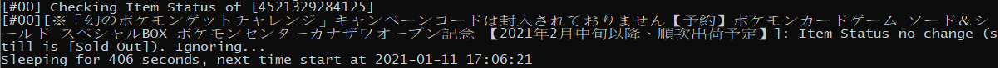

# InStockAlert
Just for personal use and crawler practice.  
This job will send an email when the target items are in stock and out of stock.  
Currently support Pokemon Center Online and Amazon JP.  

Referenced from GaryniL (https://github.com/GaryniL/Amazon-Price-Alert).

## Installation
Same as the reference.
```
$pip install -r requirements.txt
```

## Configuration
### Gmail
```
"email": {
        "smtp_url": "smtp.gmail.com:587",
        "sender": "SENDER_ADDRESS",
        "sender-password": "SENDER_PASSWORD",
        "receivers": ["RECEIVER_ADDRESS_1", "RECEIVER_ADDRESS_2"]
    }
```
- `smtp_url` don't need to change.
- `sender` is the Gmail account you want to use to send mail.
- `sender-password` can refer to [[Python實戰應用]Python寄送Gmail電子郵件實作教學](https://www.learncodewithmike.com/2020/02/python-email.html).  
In the *sender* Google account:  
    1. enable the **Two-step Authentication**.  
    2. Then generate the **Application Password**.  
  
- `receivers` will be a list of receivers' mail addresses, e.g. `["RECEIVER@gmail.com"]`

### Site
```
"sites": [
        "PokemonCenter",
        "AmazonJP"
    ]
```
`sites` can be set as `PokemonCenter` and 'AmazonJP' in a list.

### Target Items (Pokemon Center Online)
```
"item-to-parse": [
        "P_CD"
    ]
```
`item-to-parse` is a list of the **Product Code**, which can find in url.
  

### Target Items (Amazon JP)
```
"item-to-parse": [
        "ID"
    ]
```
`item-to-parse` is a list of the **Item ID**, which can also find in AmazonJP's url.
  

### Interval Time
```
"default-internal-time":300
```
`default-internal-time` default is set to 300(s).  
The job will check the items about every 300 seconds.  
Note that too high frequency may make your IP be banned.

## Run the job
```
$crawler.py
```

## UTF-8 in CMD
Refer to [在命令提示視窗(Command Prompt)顯示UTF-8內容](https://blog.darkthread.net/blog/command-prompt-codepage/)
```
$chcp 65001
```
Then the title of items can be showed correctly.  
  
